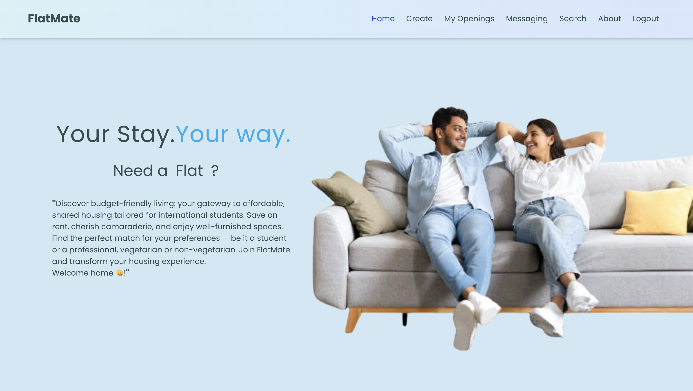
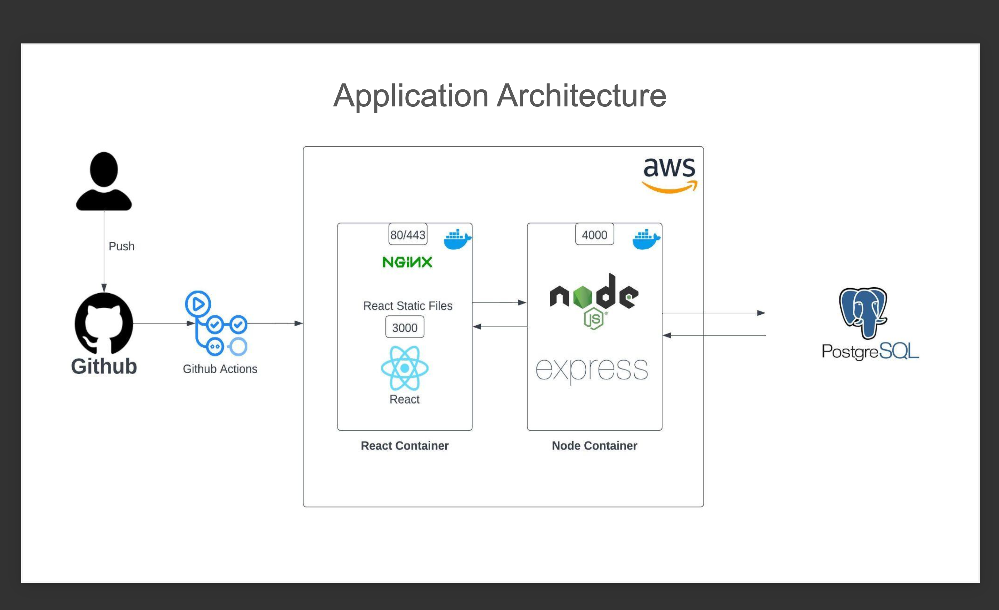
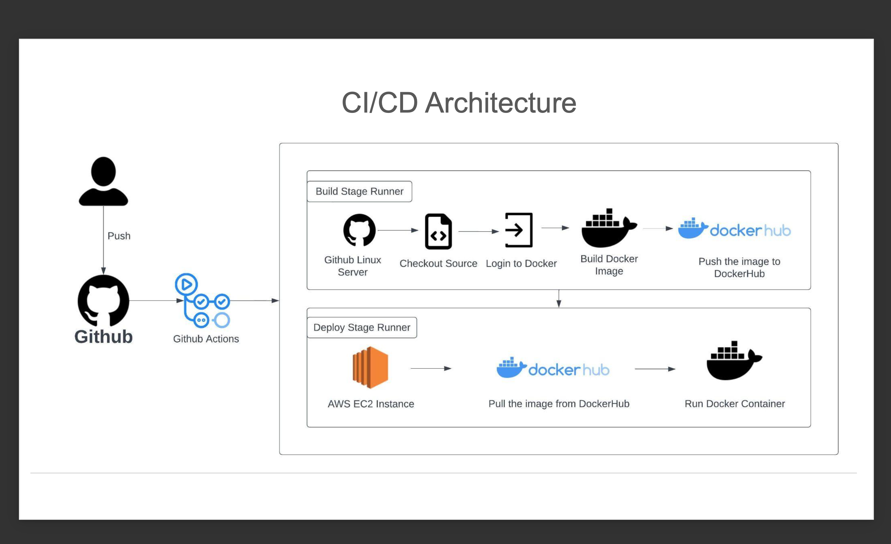
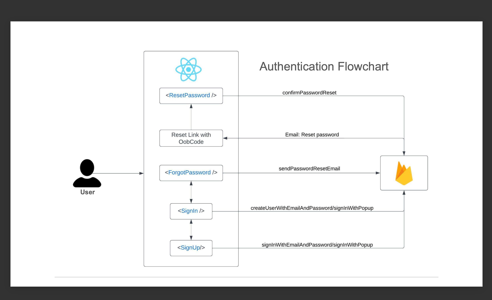
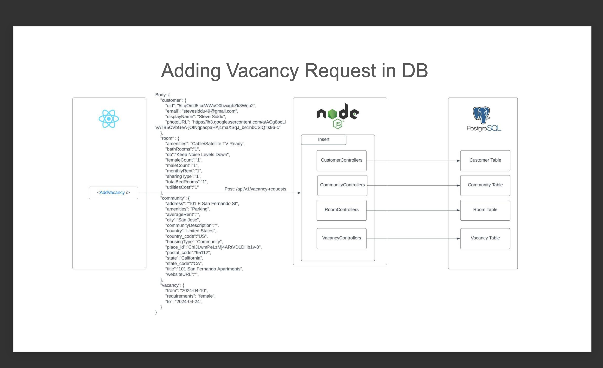
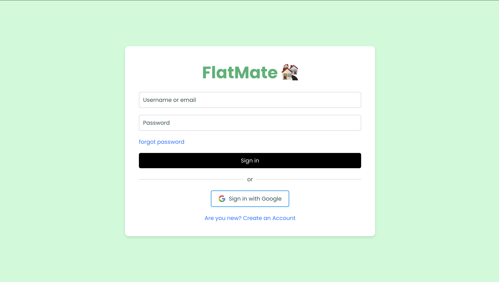
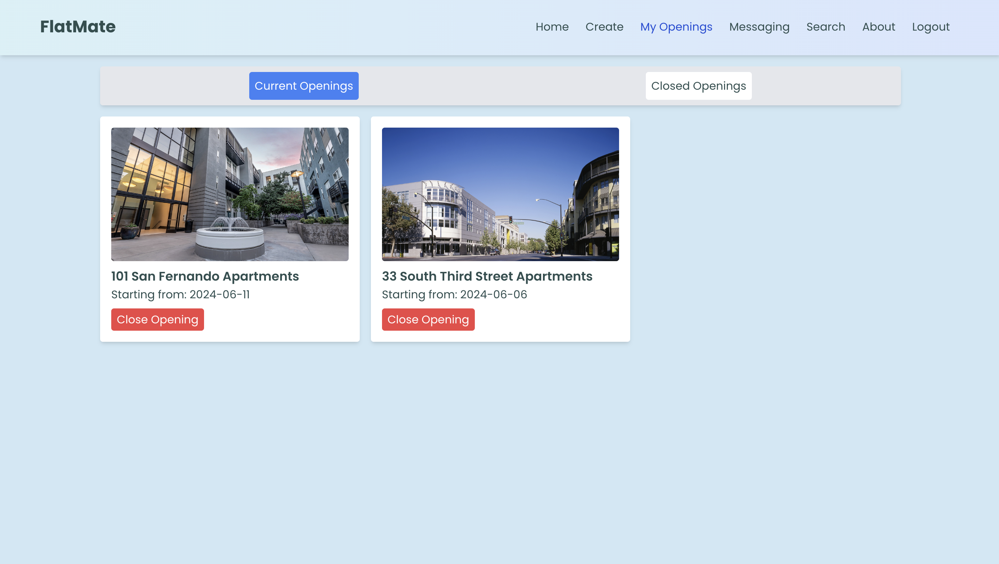
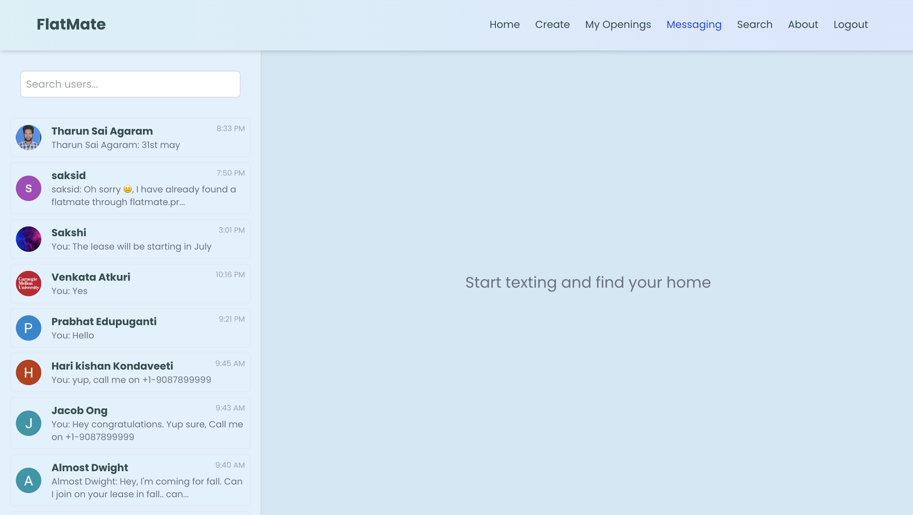
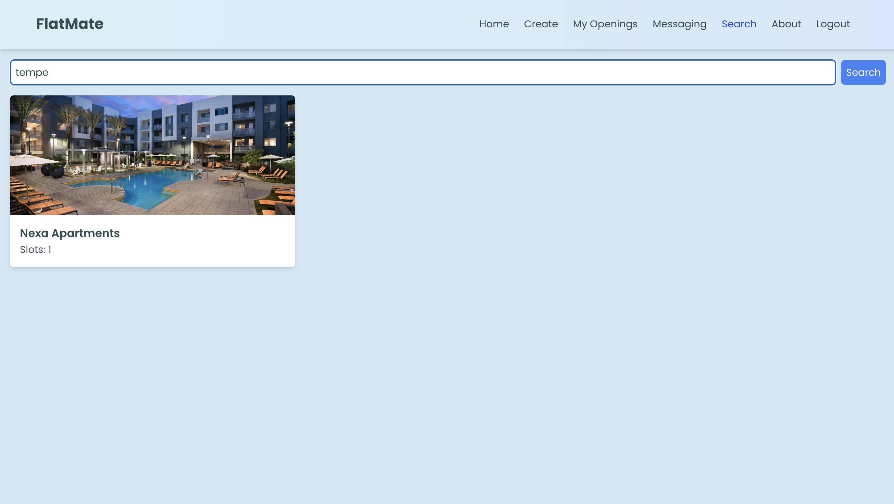
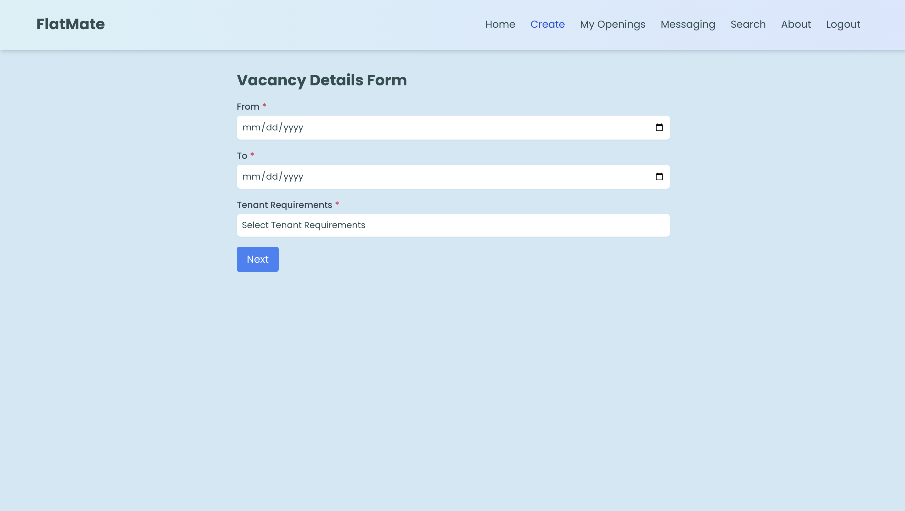

<!-- PROJECT LOGO -->

  
  <h1 align="center">Flatmate.pro</h1>
  

    Connecting People for Shared Housing Solutions
     
    <a href="https://flatmate.pro">Website</a>
  

## Table of Contents
- [About the Project](#about-the-project)
- [Technology Stack and Architecture](#technology-stack)
- [Screenshots](#screenshots)
- [License](#license)

## About the Project

flatmate.pro is a centralized platform designed to connect people looking for shared housing with those who have vacancies in their flats. It aims to simplify the process of finding suitable housing arrangements for both vacancy creators and seekers.

### The Problem

International students and others in shared housing often face challenges when roommates move out:

- Uncertainty about continuing leases
- Limited reach when searching for new roommates
- Disorganized communication across multiple platforms
- Lack of detailed information about available housing

### Solution
Flatmate.pro offers a robust platform that simplifies finding and communicating with potential roommates. Our dedicated platform expands your reach, streamlines communications, and provides detailed listings, transforming the experience of securing shared housing.

flatmate.pro addresses these issues by providing:

- A dedicated platform for listing and finding shared housing
- Wide reach to potential roommates
- Streamlined in-app communication
- Detailed listings with comprehensive information

## Features

- Create and manage vacancy listings
- Search for available housing
- In-app messaging between vacancy creators and seekers
- Detailed property information including amenities and reviews
- User profiles for both vacancy creators and seekers

## Technology Stack and Architecture

This project leverages a variety of technologies to deliver a full-fledged solution for housing needs:

- **Frontend:** React.js for a dynamic and responsive UI.
- **Backend:** Node.js with Express for RESTful API services.
- **Database:**
  - **PostgreSQL Flex on Azure:** Used for storing data about communities, customers, rooms, and vacancies.
  - **MongoDB:** Manages all chat and messaging functionalities to ensure real-time communication.
- **CI/CD:** GitHub Actions for continuous integration and deployment, ensuring seamless updates and maintenance.
- **Containerization:** Docker for creating a consistent and efficient environment for development and deployment.

### Architecture

## Screenshots

### Login

### Home

### Popular Destinations

### My Openings

### Messaging

### Search

### Create Vacancy

# Getting Started with Create React App

This project was bootstrapped with [Create React App](https://github.com/facebook/create-react-app).

## Available Scripts

In the project directory, you can run:

### `npm start`

Runs the app in the development mode.\
Open [http://localhost:3000](http://localhost:3000) to view it in your browser.

The page will reload when you make changes.\
You may also see any lint errors in the console.

### `npm test`

Launches the test runner in the interactive watch mode.\
See the section about [running tests](https://facebook.github.io/create-react-app/docs/running-tests) for more information.

### `npm run build`

Builds the app for production to the `build` folder.\
It correctly bundles React in production mode and optimizes the build for the best performance.

The build is minified and the filenames include the hashes.\
Your app is ready to be deployed!

See the section about [deployment](https://facebook.github.io/create-react-app/docs/deployment) for more information.

### `npm run eject`

**Note: this is a one-way operation. Once you `eject`, you can't go back!**

If you aren't satisfied with the build tool and configuration choices, you can `eject` at any time. This command will remove the single build dependency from your project.

Instead, it will copy all the configuration files and the transitive dependencies (webpack, Babel, ESLint, etc) right into your project so you have full control over them. All of the commands except `eject` will still work, but they will point to the copied scripts so you can tweak them. At this point you're on your own.

You don't have to ever use `eject`. The curated feature set is suitable for small and middle deployments, and you shouldn't feel obligated to use this feature. However we understand that this tool wouldn't be useful if you couldn't customize it when you are ready for it.

## Learn More

You can learn more in the [Create React App documentation](https://facebook.github.io/create-react-app/docs/getting-started).

To learn React, check out the [React documentation](https://reactjs.org/).

### Code Splitting

This section has moved here: [https://facebook.github.io/create-react-app/docs/code-splitting](https://facebook.github.io/create-react-app/docs/code-splitting)

### Analyzing the Bundle Size

This section has moved here: [https://facebook.github.io/create-react-app/docs/analyzing-the-bundle-size](https://facebook.github.io/create-react-app/docs/analyzing-the-bundle-size)

### Making a Progressive Web App

This section has moved here: [https://facebook.github.io/create-react-app/docs/making-a-progressive-web-app](https://facebook.github.io/create-react-app/docs/making-a-progressive-web-app)

### Advanced Configuration

This section has moved here: [https://facebook.github.io/create-react-app/docs/advanced-configuration](https://facebook.github.io/create-react-app/docs/advanced-configuration)

### Deployment

This section has moved here: [https://facebook.github.io/create-react-app/docs/deployment](https://facebook.github.io/create-react-app/docs/deployment)

### `npm run build` fails to minify

This section has moved here: [https://facebook.github.io/create-react-app/docs/troubleshooting#npm-run-build-fails-to-minify](https://facebook.github.io/create-react-app/docs/troubleshooting#npm-run-build-fails-to-minify)
